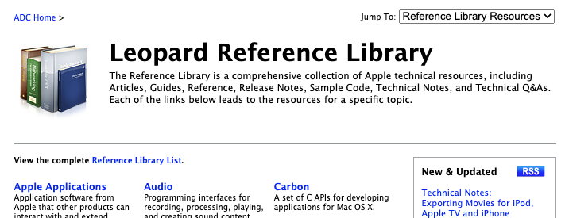

# ADC-reference-library-2009-july

This is a copy of Apple's ADC Reference Library for OS X Leopard
(from the July 2009 Apple Developer Connection [DVD set](https://www.macintoshrepository.org/26024-apple-developer-connection-2009-?ns=1)).

Viewable online at http://leopard-adc.pepas.com.

Note: two files have been compressed using xz because they exceed github's 50MB filesize limit:
- documentation/GraphicsImaging/Reference/CoreImageFilterReference/CoreImageFilterReference.pdf
- documentation/GraphicsImaging/Reference/CoreImagingRef/CoreImageRef.pdf

## Expanded Sample Code Zip Files

All of the sample code zip files have been expanded for online browsing:

- [ABPresence](samplecode/ABPresence)
- [AbstractTree](samplecode/AbstractTree)
- [AddNibToNav](samplecode/AddNibToNav)
- [AddressBookCarbon](samplecode/AddressBookCarbon)
- [AddressBookCocoa](samplecode/AddressBookCocoa)
- [AddTextMovie](samplecode/AddTextMovie)
- [AESendandReceive](samplecode/AESendandReceive)
- [AESendThreadSafe](samplecode/AESendThreadSafe)
- [AFWAVendorSpecificDriver](samplecode/AFWAVendorSpecificDriver)
- [aglClipBufferRect](samplecode/aglClipBufferRect)
- [AlbumToSlideshow](samplecode/AlbumToSlideshow)
- [AnimatedSlider](samplecode/AnimatedSlider)
- [ApertureResizer](samplecode/ApertureResizer)
- [AppearanceSampleUpdated](samplecode/AppearanceSampleUpdated)
- [AppleScriptRunner](samplecode/AppleScriptRunner)
- [ApplyFirmwarePassword](samplecode/ApplyFirmwarePassword)
- [ASCIIMoviePlayerSample](samplecode/ASCIIMoviePlayerSample)
- [AsyncPB](samplecode/AsyncPB)
- [ATSUICurveAccessDemo](samplecode/ATSUICurveAccessDemo)
- [ATSUIDirectAccessDemo](samplecode/ATSUIDirectAccessDemo)
- [AttachAScript](samplecode/AttachAScript)
- [AudioBroadcaster](samplecode/AudioBroadcaster)
- [audioburntest](samplecode/audioburntest)
- [AudioBurn](samplecode/AudioBurn)
- [AudioCDSample](samplecode/AudioCDSample)
- [AudioDeviceNotify](samplecode/AudioDeviceNotify)
- [AudioQueueTest](samplecode/AudioQueueTest)
- [AudioQueueTools](samplecode/AudioQueueTools)
- [AudioUnitEffectTemplates](samplecode/AudioUnitEffectTemplates)
- [AuntieDialog](samplecode/AuntieDialog)
- [AuthForAll](samplecode/AuthForAll)
- [AutomatorHandsOn](samplecode/AutomatorHandsOn)
- [AutoSample](samplecode/AutoSample)
- [AutoUpdater](samplecode/AutoUpdater)
- [BackgroundExporter](samplecode/BackgroundExporter)
- [BasicCocoaAnimations](samplecode/BasicCocoaAnimations)
- [BasicDataBrowser](samplecode/BasicDataBrowser)
- [BasicInputMethod](samplecode/BasicInputMethod)
- [BasicPlugIn](samplecode/BasicPlugIn)
- [BetterAuthorizationSample](samplecode/BetterAuthorizationSample)
- [BindingsJoystick](samplecode/BindingsJoystick)
- [Birthdays](samplecode/Birthdays)
- [BlitNoVBL](samplecode/BlitNoVBL)
- [BlitVBL](samplecode/BlitVBL)
- [BlockAnimation](samplecode/BlockAnimation)
- [BlockedEventQueue](samplecode/BlockedEventQueue)
- [bMoviePaletteCocoa](samplecode/bMoviePaletteCocoa)
- [bMoviePalette](samplecode/bMoviePalette)
- [BoingX](samplecode/BoingX)
- [BootstrapDump](samplecode/BootstrapDump)
- [BordersAndTitles](samplecode/BordersAndTitles)
- [Bouncy](samplecode/Bouncy)
- [BoundButton](samplecode/BoundButton)
- [BrideOfMungGrab](samplecode/BrideOfMungGrab)
- [BSDLLCTest](samplecode/BSDLLCTest)
- [BufferedWindows](samplecode/BufferedWindows)
- [bulkerase](samplecode/bulkerase)
- [BundleLoader](samplecode/BundleLoader)
- [ButtonMadness](samplecode/ButtonMadness)
- [CacheInfo-MacOSX](samplecode/CacheInfo-MacOSX)
- [CALayerEssentials](samplecode/CALayerEssentials)
- [CalcCMaskCalcMask](samplecode/CalcCMaskCalcMask)
- [Calculator](samplecode/Calculator)
- [CalendarItems](samplecode/CalendarItems)
- [CalendarView](samplecode/CalendarView)
- [CallJS](samplecode/CallJS)
- [CapabilitiesSample](samplecode/CapabilitiesSample)
- [CAPlayThrough](samplecode/CAPlayThrough)
- [CaptureAndCompressIPBMovie](samplecode/CaptureAndCompressIPBMovie)
- [CarbonCocoaCoreImageTab](samplecode/CarbonCocoaCoreImageTab)
- [CarbonCocoaTempConverter](samplecode/CarbonCocoaTempConverter)
- [CarbonCocoa_PictureCursor](samplecode/CarbonCocoa_PictureCursor)
- [CarbonCustomList](samplecode/CarbonCustomList)
- [CarbonInCocoa](samplecode/CarbonInCocoa)
- [CarbonMDEF](samplecode/CarbonMDEF)
- [CarbonPorting](samplecode/CarbonPorting)
- [CarbonPrintingSample](samplecode/CarbonPrintingSample)
- [CarbonQuartzComposer_TV](samplecode/CarbonQuartzComposer_TV)
- [CarbonQuartzDrawingWPrinting](samplecode/CarbonQuartzDrawingWPrinting)
- [CarbonSketch](samplecode/CarbonSketch)
- [CarbonSndPlayDB](samplecode/CarbonSndPlayDB)
- [CarbonTransparentWindow](samplecode/CarbonTransparentWindow)
- [Carbon_GLSnapshot](samplecode/Carbon_GLSnapshot)
- [CASoundLab2](samplecode/CASoundLab2)
- [CDROMSample](samplecode/CDROMSample)
- [CFFTPSample](samplecode/CFFTPSample)
- [CFHostSample](samplecode/CFHostSample)
- [CFLocalServer](samplecode/CFLocalServer)
- [CFM_MachO_CFM](samplecode/CFM_MachO_CFM)
- [CFNetworkHTTPDownload](samplecode/CFNetworkHTTPDownload)
- [CFPreferences](samplecode/CFPreferences)
- [CFPrefsDumper](samplecode/CFPrefsDumper)
- [CFPrefTopScores](samplecode/CFPrefTopScores)
- [CFProxySupportTool](samplecode/CFProxySupportTool)
- [CGDrawPicture](samplecode/CGDrawPicture)
- [CGGamma](samplecode/CGGamma)
- [CGRotation](samplecode/CGRotation)
- [CGText](samplecode/CGText)
- [CIAnnotation](samplecode/CIAnnotation)
- [CIColorTracking](samplecode/CIColorTracking)
- [CITransitionSelectorSample2](samplecode/CITransitionSelectorSample2)
- [CIVideoDemoGL](samplecode/CIVideoDemoGL)
- [ClockView](samplecode/ClockView)
- [Clock_Control](samplecode/Clock_Control)
- [ClosedCaptionImporter](samplecode/ClosedCaptionImporter)
- [CocoaCreateMovie](samplecode/CocoaCreateMovie)
- [CocoaDragAndDrop](samplecode/CocoaDragAndDrop)
- [CocoaDVDPlayer](samplecode/CocoaDVDPlayer)
- [CocoaEcho](samplecode/CocoaEcho)
- [CocoaGL](samplecode/CocoaGL)
- [CocoaHTTPServer](samplecode/CocoaHTTPServer)
- [CocoaInCarbon](samplecode/CocoaInCarbon)
- [CocoaPeoplePicker](samplecode/CocoaPeoplePicker)
- [CocoaSlides](samplecode/CocoaSlides)
- [CocoaSOAP](samplecode/CocoaSOAP)
- [CocoaSpeechSynthesisExample](samplecode/CocoaSpeechSynthesisExample)
- [CocoaVideoFrameToGWorld](samplecode/CocoaVideoFrameToGWorld)
- [CocoaVideoFrameToNSImage](samplecode/CocoaVideoFrameToNSImage)
- [Cocoa_-_SGDataProc](samplecode/Cocoa_-_SGDataProc)
- [Cocoa_CG_aliasing_demo](samplecode/Cocoa_CG_aliasing_demo)
- [Cocoa_CG_arc_demo](samplecode/Cocoa_CG_arc_demo)
- [Cocoa_With_Carbon_or_CPP](samplecode/Cocoa_With_Carbon_or_CPP)
- [ColorBars](samplecode/ColorBars)
- [ColorMatching](samplecode/ColorMatching)
- [ColorSwatchView](samplecode/ColorSwatchView)
- [ColorSyncDevices-Cocoa](samplecode/ColorSyncDevices-Cocoa)
- [ColorSyncDevices](samplecode/ColorSyncDevices)
- [Color_Sampler](samplecode/Color_Sampler)
- [ComboBoxPrefs](samplecode/ComboBoxPrefs)
- [CompressMovies](samplecode/CompressMovies)
- [ContentBurn](samplecode/ContentBurn)
- [ConvertMovieSndTrack](samplecode/ConvertMovieSndTrack)
- [ConvertToMovieJr](samplecode/ConvertToMovieJr)
- [CopyBitsSpeedPalette](samplecode/CopyBitsSpeedPalette)
- [CopyDeepMask](samplecode/CopyDeepMask)
- [CopyMask](samplecode/CopyMask)
- [CoreAnimationQuickTimeLayer](samplecode/CoreAnimationQuickTimeLayer)
- [CoreImageGLTextureFBO](samplecode/CoreImageGLTextureFBO)
- [CoreRecipes](samplecode/CoreRecipes)
- [CoreTextArc](samplecode/CoreTextArc)
- [CoreTextTest](samplecode/CoreTextTest)
- [CPUGestalt](samplecode/CPUGestalt)
- [CreateMovieFromReferences](samplecode/CreateMovieFromReferences)
- [CreateMovie](samplecode/CreateMovie)
- [CreatePictFile](samplecode/CreatePictFile)
- [Cropped_Image](samplecode/Cropped_Image)
- [CrossEvents](samplecode/CrossEvents)
- [CryptNoMore](samplecode/CryptNoMore)
- [CryptoSample](samplecode/CryptoSample)
- [CTMClip](samplecode/CTMClip)
- [CTMDemo](samplecode/CTMDemo)
- [CubePuzzle](samplecode/CubePuzzle)
- [CurvesDemo](samplecode/CurvesDemo)
- [CustomAtomicStoreSubclass](samplecode/CustomAtomicStoreSubclass)
- [CustomMediaIcons](samplecode/CustomMediaIcons)
- [CustomMedia](samplecode/CustomMedia)
- [CustomSave](samplecode/CustomSave)
- [CustomWindowWidget](samplecode/CustomWindowWidget)
- [CustomWindow](samplecode/CustomWindow)
- [Custom_HIView_Tutorial](samplecode/Custom_HIView_Tutorial)
- [CWCocoaComponent](samplecode/CWCocoaComponent)
- [CxxNewDelete](samplecode/CxxNewDelete)
- [databurntest](samplecode/databurntest)
- [DataBurn](samplecode/DataBurn)
- [DatePicker](samplecode/DatePicker)
- [DelegateOnlyComponent](samplecode/DelegateOnlyComponent)
- [DepartmentAndEmployees](samplecode/DepartmentAndEmployees)
- [DerivedProperty](samplecode/DerivedProperty)
- [DeskPictAppDockMenu](samplecode/DeskPictAppDockMenu)
- [Desktop_Sprites](samplecode/Desktop_Sprites)
- [DeviceListener](samplecode/DeviceListener)
- [DialogsToHIViews](samplecode/DialogsToHIViews)
- [Dicey](samplecode/Dicey)
- [DictionaryController](samplecode/DictionaryController)
- [Dimmer2Effect](samplecode/Dimmer2Effect)
- [Direct_Pixel_Access](samplecode/Direct_Pixel_Access)
- [DisplayURL](samplecode/DisplayURL)
- [dist_fft](samplecode/dist_fft)
- [DNSServiceMetaQuery](samplecode/DNSServiceMetaQuery)
- [DockBrowser](samplecode/DockBrowser)
- [DockTile](samplecode/DockTile)
- [DragItemAround](samplecode/DragItemAround)
- [DrawableBroadcaster](samplecode/DrawableBroadcaster)
- [Draw_Pixels](samplecode/Draw_Pixels)
- [DRDataBurnCarbonUI](samplecode/DRDataBurnCarbonUI)
- [DREraseCarbonUI](samplecode/DREraseCarbonUI)
- [DropDraw](samplecode/DropDraw)
- [DTSCarbonShell](samplecode/DTSCarbonShell)
- [DukeMovie](samplecode/DukeMovie)
- [DuplicateFinderItems](samplecode/DuplicateFinderItems)
- [DynamicProperties](samplecode/DynamicProperties)
- [ElectricImageComponent.win](samplecode/ElectricImageComponent.win)
- [ElectricImageComponent](samplecode/ElectricImageComponent)
- [EmbededAppleScripts](samplecode/EmbededAppleScripts)
- [EmptyFS](samplecode/EmptyFS)
- [enetlognke](samplecode/enetlognke)
- [EnhancedAudioBurn](samplecode/EnhancedAudioBurn)
- [EnhancedDataBurn](samplecode/EnhancedDataBurn)
- [Eraser](samplecode/Eraser)
- [EventMonitorTest](samplecode/EventMonitorTest)
- [ExampleIPBCodec](samplecode/ExampleIPBCodec)
- [ExampleVideoPanel](samplecode/ExampleVideoPanel)
- [ExtractMovieAudioToAIFF](samplecode/ExtractMovieAudioToAIFF)
- [FancyAbout](samplecode/FancyAbout)
- [FBOBunnies](samplecode/FBOBunnies)
- [Fiendishthngs](samplecode/Fiendishthngs)
- [FileNotification](samplecode/FileNotification)
- [filesystem_examples](samplecode/filesystem_examples)
- [FilterDemo](samplecode/FilterDemo)
- [FinalCutPro_AppleEvents](samplecode/FinalCutPro_AppleEvents)
- [FinderLaunch](samplecode/FinderLaunch)
- [FloatingWindow](samplecode/FloatingWindow)
- [Fortune](samplecode/Fortune)
- [FractalPerformance](samplecode/FractalPerformance)
- [FSCopyObject](samplecode/FSCopyObject)
- [FSCreateFileAndOpenForkUnicode](samplecode/FSCreateFileAndOpenForkUnicode)
- [FSFileOperation](samplecode/FSFileOperation)
- [FSMegaInfo](samplecode/FSMegaInfo)
- [FSRemoveInheritedACEs](samplecode/FSRemoveInheritedACEs)
- [FSReplaceObject](samplecode/FSReplaceObject)
- [FullScreen](samplecode/FullScreen)
- [FunkyOverlayWindow](samplecode/FunkyOverlayWindow)
- [FunWithFileDialogs](samplecode/FunWithFileDialogs)
- [GammaFilterforFxPlugandAE](samplecode/GammaFilterforFxPlugandAE)
- [GeekGameBoard](samplecode/GeekGameBoard)
- [GetHWEthernetAddr](samplecode/GetHWEthernetAddr)
- [GetMACAddressSample](samplecode/GetMACAddressSample)
- [GetPrimaryMACAddress](samplecode/GetPrimaryMACAddress)
- [GetSetOptions](samplecode/GetSetOptions)
- [GLCarbon1ContextPbuffer](samplecode/GLCarbon1ContextPbuffer)
- [GLCarbonSharedPbuffer](samplecode/GLCarbonSharedPbuffer)
- [GLChildWindowDemo](samplecode/GLChildWindowDemo)
- [GLSLBasicsCocoaDL](samplecode/GLSLBasicsCocoaDL)
- [GLSLShowpieceLite](samplecode/GLSLShowpieceLite)
- [GLSLShowpiece](samplecode/GLSLShowpiece)
- [GLUTBasics](samplecode/GLUTBasics)
- [GLUTStereo](samplecode/GLUTStereo)
- [GLUTSurfaceTexture](samplecode/GLUTSurfaceTexture)
- [glut](samplecode/glut)
- [GrabBag](samplecode/GrabBag)
- [Grady](samplecode/Grady)
- [Graphic_Import-Export](samplecode/Graphic_Import-Export)
- [GreyscaleEffectSample](samplecode/GreyscaleEffectSample)
- [GridCalendar](samplecode/GridCalendar)
- [GroupDrawing](samplecode/GroupDrawing)
- [HackTVCarbon](samplecode/HackTVCarbon)
- [HandyScrollingSample](samplecode/HandyScrollingSample)
- [HelloStudio](samplecode/HelloStudio)
- [HelpHook](samplecode/HelpHook)
- [HexEditorView](samplecode/HexEditorView)
- [HICustomLeftRightSwitch](samplecode/HICustomLeftRightSwitch)
- [HICustomPushButton](samplecode/HICustomPushButton)
- [HIDoubleSlider](samplecode/HIDoubleSlider)
- [HID_Calibrator](samplecode/HID_Calibrator)
- [HID_Config_Save](samplecode/HID_Config_Save)
- [HID_Explorer](samplecode/HID_Explorer)
- [HID_LED_test_tool](samplecode/HID_LED_test_tool)
- [HID_Manager_Basics](samplecode/HID_Manager_Basics)
- [HID_Utilities_Source](samplecode/HID_Utilities_Source)
- [HIEmbedder](samplecode/HIEmbedder)
- [HIFleetingControls](samplecode/HIFleetingControls)
- [HIObjectThreadController](samplecode/HIObjectThreadController)
- [HIScrollingTextBox](samplecode/HIScrollingTextBox)
- [HISimpleList](samplecode/HISimpleList)
- [HITextShowcase](samplecode/HITextShowcase)
- [HITextViewDemo](samplecode/HITextViewDemo)
- [HITextViewShowcase](samplecode/HITextViewShowcase)
- [HIToolboxSOU-Delegates](samplecode/HIToolboxSOU-Delegates)
- [HIToolboxSOU-MenuItemViews](samplecode/HIToolboxSOU-MenuItemViews)
- [HIView-NSView](samplecode/HIView-NSView)
- [HIViewTest](samplecode/HIViewTest)
- [HTMLSample](samplecode/HTMLSample)
- [HTMLStore](samplecode/HTMLStore)
- [HTMLUserPane](samplecode/HTMLUserPane)
- [IBFragmentVIew](samplecode/IBFragmentVIew)
- [ICADownloadFirst](samplecode/ICADownloadFirst)
- [ICAObjectDumper](samplecode/ICAObjectDumper)
- [iChatStatusFromApplication](samplecode/iChatStatusFromApplication)
- [IconCollection](samplecode/IconCollection)
- [IdentitySample](samplecode/IdentitySample)
- [iGetKeys](samplecode/iGetKeys)
- [IKImageBrowserViewWithCoreData](samplecode/IKImageBrowserViewWithCoreData)
- [IKSlideshowDemo](samplecode/IKSlideshowDemo)
- [ImageApp](samplecode/ImageApp)
- [ImageBackground](samplecode/ImageBackground)
- [ImageBrowserView](samplecode/ImageBrowserView)
- [ImageBrowser](samplecode/ImageBrowser)
- [ImageClient](samplecode/ImageClient)
- [ImageCompositing](samplecode/ImageCompositing)
- [ImageFile](samplecode/ImageFile)
- [ImageMapExample](samplecode/ImageMapExample)
- [ImageMapView](samplecode/ImageMapView)
- [ImageProducing](samplecode/ImageProducing)
- [ImagesToQTMovie](samplecode/ImagesToQTMovie)
- [Image_Difference](samplecode/Image_Difference)
- [ImportExport](samplecode/ImportExport)
- [ImproveYourImage](samplecode/ImproveYourImage)
- [InkSample](samplecode/InkSample)
- [InstallerPluginSample](samplecode/InstallerPluginSample)
- [IOKitWithLibrary](samplecode/IOKitWithLibrary)
- [IOPrintSuperClasses](samplecode/IOPrintSuperClasses)
- [iSpend](samplecode/iSpend)
- [iTunesController](samplecode/iTunesController)
- [JavaEOGenerator](samplecode/JavaEOGenerator)
- [JavaFrameEmbeddingDemo](samplecode/JavaFrameEmbeddingDemo)
- [JavaSplashScreen](samplecode/JavaSplashScreen)
- [JAWTExample](samplecode/JAWTExample)
- [JDragNDrop](samplecode/JDragNDrop)
- [JNISample](samplecode/JNISample)
- [JSheets](samplecode/JSheets)
- [JSInterpreter](samplecode/JSInterpreter)
- [JSPong](samplecode/JSPong)
- [JustDraw](samplecode/JustDraw)
- [KauthORama](samplecode/KauthORama)
- [KerberosGSS](samplecode/KerberosGSS)
- [KeyboardController](samplecode/KeyboardController)
- [KillEveryOneButMe](samplecode/KillEveryOneButMe)
- [LayerBackedOpenGLView](samplecode/LayerBackedOpenGLView)
- [LayoutManagerDemo](samplecode/LayoutManagerDemo)
- [LinkSnoop](samplecode/LinkSnoop)
- [ListMania](samplecode/ListMania)
- [LittleArrowsShowcase](samplecode/LittleArrowsShowcase)
- [LiveVideoMixer2](samplecode/LiveVideoMixer2)
- [LiveVideoMixer3](samplecode/LiveVideoMixer3)
- [LiveVideoMixer](samplecode/LiveVideoMixer)
- [LocalServer](samplecode/LocalServer)
- [LoginItemsAE](samplecode/LoginItemsAE)
- [LSMSmartCategorizer](samplecode/LSMSmartCategorizer)
- [MachPortDump](samplecode/MachPortDump)
- [Magnify](samplecode/Magnify)
- [MakeEffectMovie](samplecode/MakeEffectMovie)
- [makeiPhoneRefMovie](samplecode/makeiPhoneRefMovie)
- [ManagedObjectDataFormatter](samplecode/ManagedObjectDataFormatter)
- [MapLargeFile](samplecode/MapLargeFile)
- [MassiveImage](samplecode/MassiveImage)
- [MediaPresenter](samplecode/MediaPresenter)
- [MemoryBasedBundle](samplecode/MemoryBasedBundle)
- [MenuItemView](samplecode/MenuItemView)
- [MenuViews](samplecode/MenuViews)
- [MethodReplacement](samplecode/MethodReplacement)
- [MFSLives](samplecode/MFSLives)
- [MLTE_CustomScrolling](samplecode/MLTE_CustomScrolling)
- [ModeWhacker](samplecode/ModeWhacker)
- [Mode](samplecode/Mode)
- [Monochrome_Image](samplecode/Monochrome_Image)
- [MoreIsBetter](samplecode/MoreIsBetter)
- [MoreSCF](samplecode/MoreSCF)
- [Moriarity](samplecode/Moriarity)
- [Mountains](samplecode/Mountains)
- [MouseTracking](samplecode/MouseTracking)
- [MovieAssembler](samplecode/MovieAssembler)
- [MovieCallbacks](samplecode/MovieCallbacks)
- [MovieGWorlds](samplecode/MovieGWorlds)
- [MovieSprites](samplecode/MovieSprites)
- [MovieTextFinder](samplecode/MovieTextFinder)
- [MovieVideoChart](samplecode/MovieVideoChart)
- [Movie_From_DataRef](samplecode/Movie_From_DataRef)
- [Movie_Overlay](samplecode/Movie_Overlay)
- [MovingToGCC4](samplecode/MovingToGCC4)
- [MP3_Player](samplecode/MP3_Player)
- [MPDelayUntilTest](samplecode/MPDelayUntilTest)
- [MPPeriodicalTest](samplecode/MPPeriodicalTest)
- [MultiprecisionFP](samplecode/MultiprecisionFP)
- [MungSaver](samplecode/MungSaver)
- [Music](samplecode/Music)
- [MyCustomColorPicker](samplecode/MyCustomColorPicker)
- [MyDeviceLoop](samplecode/MyDeviceLoop)
- [MyFirstJNIProject](samplecode/MyFirstJNIProject)
- [MyMovieFilter](samplecode/MyMovieFilter)
- [MyPhoto](samplecode/MyPhoto)
- [MYRecorder](samplecode/MYRecorder)
- [NameAndAddress](samplecode/NameAndAddress)
- [NameAndPassword](samplecode/NameAndPassword)
- [NetworkAuthentication](samplecode/NetworkAuthentication)
- [NewsReader](samplecode/NewsReader)
- [New_NewGWorld](samplecode/New_NewGWorld)
- [NoCopyReceives](samplecode/NoCopyReceives)
- [NotifyTool](samplecode/NotifyTool)
- [NSFontAttributeExplorer](samplecode/NSFontAttributeExplorer)
- [NSGLImage](samplecode/NSGLImage)
- [NSLMiniBrowser](samplecode/NSLMiniBrowser)
- [NSOpenGL_Fullscreen](samplecode/NSOpenGL_Fullscreen)
- [NSOperationSample](samplecode/NSOperationSample)
- [NullAuthPlugin](samplecode/NullAuthPlugin)
- [NumberInput_IMKit_Sample](samplecode/NumberInput_IMKit_Sample)
- [NURBSSurfaceVertexProg](samplecode/NURBSSurfaceVertexProg)
- [ObjectPath](samplecode/ObjectPath)
- [OpenALExample](samplecode/OpenALExample)
- [OpenGLCompositorLab](samplecode/OpenGLCompositorLab)
- [OpenGLFilterBasicsCocoa](samplecode/OpenGLFilterBasicsCocoa)
- [OpenGLMovieQT](samplecode/OpenGLMovieQT)
- [OpenGLScreenCapture](samplecode/OpenGLScreenCapture)
- [OpenGLScreenSnapshot](samplecode/OpenGLScreenSnapshot)
- [OpenGL_Image](samplecode/OpenGL_Image)
- [OpenGL_Movie](samplecode/OpenGL_Movie)
- [OpenGL_Screensaver](samplecode/OpenGL_Screensaver)
- [OpenGL_Stereo](samplecode/OpenGL_Stereo)
- [OSXAdapter](samplecode/OSXAdapter)
- [OTCheckNetForNBPName](samplecode/OTCheckNetForNBPName)
- [OTEndpointInfo](samplecode/OTEndpointInfo)
- [OTLookupNameTest](samplecode/OTLookupNameTest)
- [OTMP](samplecode/OTMP)
- [OTSimpleDownloadHTTP](samplecode/OTSimpleDownloadHTTP)
- [OTSimpleServerHTTP](samplecode/OTSimpleServerHTTP)
- [OutputBins2PDE](samplecode/OutputBins2PDE)
- [Palette_and_GWorld](samplecode/Palette_and_GWorld)
- [PasteboardPeeker](samplecode/PasteboardPeeker)
- [PBORenderToVertexArray](samplecode/PBORenderToVertexArray)
- [PDEProject](samplecode/PDEProject)
- [PDFAnnotationEditor](samplecode/PDFAnnotationEditor)
- [PDFCalendar](samplecode/PDFCalendar)
- [PDFKitLinker2](samplecode/PDFKitLinker2)
- [PDFView](samplecode/PDFView)
- [People](samplecode/People)
- [PersistentDocumentFileWrappers](samplecode/PersistentDocumentFileWrappers)
- [PhotoSearch](samplecode/PhotoSearch)
- [PictureSharingBrowser](samplecode/PictureSharingBrowser)
- [PictureSharing](samplecode/PictureSharing)
- [PictureShow](samplecode/PictureShow)
- [PictureTaker](samplecode/PictureTaker)
- [PIDFromBSDProcessName](samplecode/PIDFromBSDProcessName)
- [PixMap2PixPat2ppat](samplecode/PixMap2PixPat2ppat)
- [PlayAudioFileLite](samplecode/PlayAudioFileLite)
- [PlayMovieJava](samplecode/PlayMovieJava)
- [PlayMovie](samplecode/PlayMovie)
- [PlaySound](samplecode/PlaySound)
- [PlayTune](samplecode/PlayTune)
- [Play_Movie_with_Controller](samplecode/Play_Movie_with_Controller)
- [PMPrinterPrintWithFile](samplecode/PMPrinterPrintWithFile)
- [PMPrinterTest](samplecode/PMPrinterTest)
- [Polygons](samplecode/Polygons)
- [PortMapper](samplecode/PortMapper)
- [PredicateEditorSample](samplecode/PredicateEditorSample)
- [PrefsPane](samplecode/PrefsPane)
- [PreLoginAgents](samplecode/PreLoginAgents)
- [Processes](samplecode/Processes)
- [Process](samplecode/Process)
- [ProfileSystem](samplecode/ProfileSystem)
- [PThreadSorts](samplecode/PThreadSorts)
- [QCCocoaComponent](samplecode/QCCocoaComponent)
- [QDCocoaComponent](samplecode/QDCocoaComponent)
- [QISA](samplecode/QISA)
- [QTAudioContextInsert](samplecode/QTAudioContextInsert)
- [QTAudioExtractionPanel](samplecode/QTAudioExtractionPanel)
- [QTBRemoteAdmin](samplecode/QTBRemoteAdmin)
- [QTButtonDemo](samplecode/QTButtonDemo)
- [QTCaptureWidget](samplecode/QTCaptureWidget)
- [QTCarbonCoreImage101](samplecode/QTCarbonCoreImage101)
- [QTCarbonShell](samplecode/QTCarbonShell)
- [QTCompressionOptionsWindow](samplecode/QTCompressionOptionsWindow)
- [QTCoreImage101](samplecode/QTCoreImage101)
- [QTCoreVideo101](samplecode/QTCoreVideo101)
- [QTCoreVideo102](samplecode/QTCoreVideo102)
- [QTCoreVideo103](samplecode/QTCoreVideo103)
- [QTCoreVideo201](samplecode/QTCoreVideo201)
- [QTCoreVideo202](samplecode/QTCoreVideo202)
- [QTCoreVideo301](samplecode/QTCoreVideo301)
- [QTEffectsDialog_-_Cocoa](samplecode/QTEffectsDialog_-_Cocoa)
- [QTEffectsJava](samplecode/QTEffectsJava)
- [QTExtractAndConvertToAIFF](samplecode/QTExtractAndConvertToAIFF)
- [QTExtractAndConvertToMovieFile](samplecode/QTExtractAndConvertToMovieFile)
- [QTGraphicsImport](samplecode/QTGraphicsImport)
- [QTKitAdvancedDocument](samplecode/QTKitAdvancedDocument)
- [QTKitButtonTester](samplecode/QTKitButtonTester)
- [QTKitCreateMovie](samplecode/QTKitCreateMovie)
- [QTKitFrameStepper](samplecode/QTKitFrameStepper)
- [QTKitImport](samplecode/QTKitImport)
- [QTKitMovieFrameImage](samplecode/QTKitMovieFrameImage)
- [QTKitMovieShuffler](samplecode/QTKitMovieShuffler)
- [QTKitPlayer](samplecode/QTKitPlayer)
- [QTKitProgressTester](samplecode/QTKitProgressTester)
- [QTKitSimpleDocument](samplecode/QTKitSimpleDocument)
- [QTKitThreadedExport](samplecode/QTKitThreadedExport)
- [QTKitThreadsExporter](samplecode/QTKitThreadsExporter)
- [QTKitTimeCode](samplecode/QTKitTimeCode)
- [QTMetadataEditor](samplecode/QTMetadataEditor)
- [QTMetaData](samplecode/QTMetaData)
- [QTMP3Player](samplecode/QTMP3Player)
- [QTNoStepsDemo](samplecode/QTNoStepsDemo)
- [QTPixelBufferVCToCGImage](samplecode/QTPixelBufferVCToCGImage)
- [QTQuartzPlayer](samplecode/QTQuartzPlayer)
- [QTRecorder](samplecode/QTRecorder)
- [QTSimpleApplet](samplecode/QTSimpleApplet)
- [QTSSConnectionMonitor](samplecode/QTSSConnectionMonitor)
- [QTSSInspector](samplecode/QTSSInspector)
- [QTStreamingApplet](samplecode/QTStreamingApplet)
- [QTtoCG](samplecode/QTtoCG)
- [QTtoJavaImage](samplecode/QTtoJavaImage)
- [QTVector](samplecode/QTVector)
- [Quartz2DBasics](samplecode/Quartz2DBasics)
- [Quartz2DShadings](samplecode/Quartz2DShadings)
- [QuartzCache](samplecode/QuartzCache)
- [QuartzComposerLiveDV](samplecode/QuartzComposerLiveDV)
- [QuartzComposerMatrix](samplecode/QuartzComposerMatrix)
- [QuartzComposerOffline](samplecode/QuartzComposerOffline)
- [QuartzComposerTexture](samplecode/QuartzComposerTexture)
- [QuartzComposer_WWDC_QCTV](samplecode/QuartzComposer_WWDC_QCTV)
- [QuartzComposer_WWDC_TextEdit](samplecode/QuartzComposer_WWDC_TextEdit)
- [QuartzLines](samplecode/QuartzLines)
- [QuartzShapes](samplecode/QuartzShapes)
- [Quartz_EB](samplecode/Quartz_EB)
- [QuickDraw_FX](samplecode/QuickDraw_FX)
- [QuickTimeMovieControl](samplecode/QuickTimeMovieControl)
- [RecentItems](samplecode/RecentItems)
- [RecordAudioToFile](samplecode/RecordAudioToFile)
- [Reducer](samplecode/Reducer)
- [Red_Rocket](samplecode/Red_Rocket)
- [Reminders](samplecode/Reminders)
- [RGB_Image](samplecode/RGB_Image)
- [RGB_ValueTransformers](samplecode/RGB_ValueTransformers)
- [RotateString](samplecode/RotateString)
- [Rotate_Bitmap_90](samplecode/Rotate_Bitmap_90)
- [RoundTransparentWindow](samplecode/RoundTransparentWindow)
- [Rubber_Bandit](samplecode/Rubber_Bandit)
- [SampleButtonPlugin](samplecode/SampleButtonPlugin)
- [SampleCMPlugIn](samplecode/SampleCMPlugIn)
- [SampleDS](samplecode/SampleDS)
- [SampleD](samplecode/SampleD)
- [SampleFilterScheme](samplecode/SampleFilterScheme)
- [SampleScannerApp](samplecode/SampleScannerApp)
- [SampleUSBAudioPlugin](samplecode/SampleUSBAudioPlugin)
- [Save_PICT_file](samplecode/Save_PICT_file)
- [SayIt](samplecode/SayIt)
- [SBSendEmail](samplecode/SBSendEmail)
- [SBSetFinderComment](samplecode/SBSetFinderComment)
- [SBSystemPrefs](samplecode/SBSystemPrefs)
- [scaudiocompress](samplecode/scaudiocompress)
- [ScriptBuildPhases](samplecode/ScriptBuildPhases)
- [ScriptingBridgeFinder](samplecode/ScriptingBridgeFinder)
- [ScriptingBridgeiCal](samplecode/ScriptingBridgeiCal)
- [ScriptView](samplecode/ScriptView)
- [ScrollAndZoom](samplecode/ScrollAndZoom)
- [SCSIHBAEmulator](samplecode/SCSIHBAEmulator)
- [SCSIOldAndNew](samplecode/SCSIOldAndNew)
- [SDKExample](samplecode/SDKExample)
- [SearchField](samplecode/SearchField)
- [SeedCFill](samplecode/SeedCFill)
- [SeeMyFriends](samplecode/SeeMyFriends)
- [SegmentView](samplecode/SegmentView)
- [SerialPortSample](samplecode/SerialPortSample)
- [SetCustomIcon](samplecode/SetCustomIcon)
- [SetMouseAcclSample](samplecode/SetMouseAcclSample)
- [SGCapture2Disk](samplecode/SGCapture2Disk)
- [SGCapture](samplecode/SGCapture)
- [SGDataProcDemo](samplecode/SGDataProcDemo)
- [SGDataProcSample](samplecode/SGDataProcSample)
- [SGDevices](samplecode/SGDevices)
- [SharedMemory](samplecode/SharedMemory)
- [Sheets](samplecode/Sheets)
- [SillyFrequencyLevels](samplecode/SillyFrequencyLevels)
- [Simon](samplecode/Simon)
- [SimpleAudioExtraction](samplecode/SimpleAudioExtraction)
- [simpleAVC](samplecode/simpleAVC)
- [SimpleBindingsAdoption](samplecode/SimpleBindingsAdoption)
- [SimpleCalendar](samplecode/SimpleCalendar)
- [SimpleCarbonAppleScript](samplecode/SimpleCarbonAppleScript)
- [SimpleCocoaApp](samplecode/SimpleCocoaApp)
- [SimpleCocoaJavaMovieCocoa](samplecode/SimpleCocoaJavaMovieCocoa)
- [SimpleCocoaJavaMovie](samplecode/SimpleCocoaJavaMovie)
- [SimpleCocoaMovieQT](samplecode/SimpleCocoaMovieQT)
- [SimpleCocoaMovie](samplecode/SimpleCocoaMovie)
- [SimpleDataQueue](samplecode/SimpleDataQueue)
- [SimpleDial](samplecode/SimpleDial)
- [SimpleDownload](samplecode/SimpleDownload)
- [SimpleHelp](samplecode/SimpleHelp)
- [SimpleHIMovieViewPlayer](samplecode/SimpleHIMovieViewPlayer)
- [simpleJavaLauncher](samplecode/simpleJavaLauncher)
- [SimpleList](samplecode/SimpleList)
- [SimplePing](samplecode/SimplePing)
- [SimplePlayThru](samplecode/SimplePlayThru)
- [SimpleReach](samplecode/SimpleReach)
- [SimpleScriptingObjects](samplecode/SimpleScriptingObjects)
- [SimpleScriptingProperties](samplecode/SimpleScriptingProperties)
- [SimpleScriptingVerbs](samplecode/SimpleScriptingVerbs)
- [SimpleScripting](samplecode/SimpleScripting)
- [SimpleSpeechRecExample](samplecode/SimpleSpeechRecExample)
- [SimpleTabControl](samplecode/SimpleTabControl)
- [SimpleThreads](samplecode/SimpleThreads)
- [SimpleUserClient](samplecode/SimpleUserClient)
- [SimpleVideoOut](samplecode/SimpleVideoOut)
- [Simple_AppKit](samplecode/Simple_AppKit)
- [Sketch-112](samplecode/Sketch-112)
- [SkyCreator](samplecode/SkyCreator)
- [SlideShowImporter](samplecode/SlideShowImporter)
- [SlideShowJava](samplecode/SlideShowJava)
- [SMARTQuery](samplecode/SMARTQuery)
- [Snapshot](samplecode/Snapshot)
- [SOAPClient](samplecode/SOAPClient)
- [SOAPServer](samplecode/SOAPServer)
- [SocketCancel](samplecode/SocketCancel)
- [SoftVDigX](samplecode/SoftVDigX)
- [SoftVideoOutputComponent](samplecode/SoftVideoOutputComponent)
- [SonOfGrab](samplecode/SonOfGrab)
- [SonOfSillyBalls](samplecode/SonOfSillyBalls)
- [SoundMemRecord](samplecode/SoundMemRecord)
- [SoundMeter](samplecode/SoundMeter)
- [SoundPlayer](samplecode/SoundPlayer)
- [SoundRecord](samplecode/SoundRecord)
- [SourceView](samplecode/SourceView)
- [SpecialPictureProtocol](samplecode/SpecialPictureProtocol)
- [SpeedometerView](samplecode/SpeedometerView)
- [SpellingChecker-CarbonCocoa-Bundled](samplecode/SpellingChecker-CarbonCocoa-Bundled)
- [SpellingChecker-CarbonCocoa](samplecode/SpellingChecker-CarbonCocoa)
- [SpellingChecker-CocoaCarbon](samplecode/SpellingChecker-CocoaCarbon)
- [SplitView](samplecode/SplitView)
- [SpotlightAPI](samplecode/SpotlightAPI)
- [SpotlightFortunes](samplecode/SpotlightFortunes)
- [Spotlight](samplecode/Spotlight)
- [Sproing](samplecode/Sproing)
- [Squiggles](samplecode/Squiggles)
- [SSLSample](samplecode/SSLSample)
- [StarMenu](samplecode/StarMenu)
- [StickiesExample](samplecode/StickiesExample)
- [StillMotion](samplecode/StillMotion)
- [StyleFlatteningSample](samplecode/StyleFlatteningSample)
- [SuperSnapshot](samplecode/SuperSnapshot)
- [SurfaceVertexProgram](samplecode/SurfaceVertexProgram)
- [SuspendAppleEvent](samplecode/SuspendAppleEvent)
- [SwapLAF](samplecode/SwapLAF)
- [TabsShowcase](samplecode/TabsShowcase)
- [tcplognke](samplecode/tcplognke)
- [TemperatureTester](samplecode/TemperatureTester)
- [Test64BitMultiprec](samplecode/Test64BitMultiprec)
- [TextDemo](samplecode/TextDemo)
- [TextEditPlus](samplecode/TextEditPlus)
- [TextLayoutDemo](samplecode/TextLayoutDemo)
- [TextLinks](samplecode/TextLinks)
- [TextNameTool](samplecode/TextNameTool)
- [TexturePerformanceDemo](samplecode/TexturePerformanceDemo)
- [TextureRange](samplecode/TextureRange)
- [TextViewConfig](samplecode/TextViewConfig)
- [TextViewDelegate](samplecode/TextViewDelegate)
- [ThreadsExporter](samplecode/ThreadsExporter)
- [ThreadsExportMovie](samplecode/ThreadsExportMovie)
- [ThreadsImporter](samplecode/ThreadsImporter)
- [ThreadsImportMovie](samplecode/ThreadsImportMovie)
- [TickerView](samplecode/TickerView)
- [Tiler](samplecode/Tiler)
- [TimeCallbackDemo](samplecode/TimeCallbackDemo)
- [TimeCode](samplecode/TimeCode)
- [TimelineToTC](samplecode/TimelineToTC)
- [TimerEventSample](samplecode/TimerEventSample)
- [TimeSlaving](samplecode/TimeSlaving)
- [Tinted_Image](samplecode/Tinted_Image)
- [TipWrapper](samplecode/TipWrapper)
- [ToolbarSample](samplecode/ToolbarSample)
- [TrackBall](samplecode/TrackBall)
- [TrackFormatDemo](samplecode/TrackFormatDemo)
- [TrackIt](samplecode/TrackIt)
- [Transformed_Image](samplecode/Transformed_Image)
- [Transitions](samplecode/Transitions)
- [TremoloUnit](samplecode/TremoloUnit)
- [TrivialThreads](samplecode/TrivialThreads)
- [TwoManyControllers](samplecode/TwoManyControllers)
- [TypeServicesForUnicode](samplecode/TypeServicesForUnicode)
- [UIElementInspector](samplecode/UIElementInspector)
- [UnsharpMask](samplecode/UnsharpMask)
- [URLTextView](samplecode/URLTextView)
- [USBPrivateDataSample](samplecode/USBPrivateDataSample)
- [UTXplorer](samplecode/UTXplorer)
- [VBL](samplecode/VBL)
- [vDSPExamples](samplecode/vDSPExamples)
- [VendorSpecificType00](samplecode/VendorSpecificType00)
- [Verification](samplecode/Verification)
- [VertexPerformanceDemo](samplecode/VertexPerformanceDemo)
- [VertexPerformanceTest](samplecode/VertexPerformanceTest)
- [Vertex_Optimization](samplecode/Vertex_Optimization)
- [VideoHardwareInfo](samplecode/VideoHardwareInfo)
- [VideoProcessing](samplecode/VideoProcessing)
- [VideoViewer](samplecode/VideoViewer)
- [Video_Hardware_Info](samplecode/Video_Hardware_Info)
- [ViewController](samplecode/ViewController)
- [VolumeToBSDNode](samplecode/VolumeToBSDNode)
- [VRInteraction](samplecode/VRInteraction)
- [vrmovies](samplecode/vrmovies)
- [Watcher](samplecode/Watcher)
- [WcharDataFormatter](samplecode/WcharDataFormatter)
- [WebKitCIPlugIn](samplecode/WebKitCIPlugIn)
- [WebKitDOMElementPlugIn](samplecode/WebKitDOMElementPlugIn)
- [WebKitPluginStarter](samplecode/WebKitPluginStarter)
- [WebKitPluginWithJavaScript](samplecode/WebKitPluginWithJavaScript)
- [WebKitPluginWithSimpleGUI](samplecode/WebKitPluginWithSimpleGUI)
- [WhackedTV](samplecode/WhackedTV)
- [WindowFun](samplecode/WindowFun)
- [WiredSpritesJava](samplecode/WiredSpritesJava)
- [WiredSprites](samplecode/WiredSprites)
- [WithAndWithoutBindings](samplecode/WithAndWithoutBindings)
- [Worm](samplecode/Worm)
- [WritableFileDemo](samplecode/WritableFileDemo)
- [X11CallCarbonAndCocoa](samplecode/X11CallCarbonAndCocoa)
- [XcodeClientServer](samplecode/XcodeClientServer)
- [XML_Transport](samplecode/XML_Transport)
- [YASTControl](samplecode/YASTControl)
- [ZoomRecter](samplecode/ZoomRecter)
